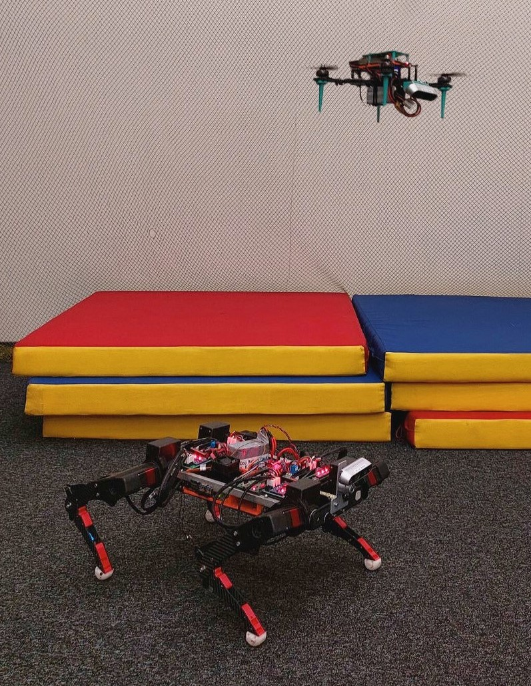

# NeuroSwarm: Neural 3D Scene Reconstruction and Segmentation with Multi-agent UAV for Optimal Navigation of Quadruped Robot
   


1. End-to-End 3D Scene Reconstruction from Posed Images (https://github.com/magicleap/Atlas)


## Installation
Docker image `Docker/Dockerfile` with all the dependencies.

Or you can install them yourself:
```
sudo apt-get install cuda-toolkit-11-3
export PATH=usr/local/cuda-11.3/bin${PATH:+:${PATH}}
conda create - -name atlas
conda activate atlas

conda install pytorch==1.10.0 torchvision==0.11.0 torchaudio==0.10.0 cudatoolkit=11.3 -c pytorch -c conda-forge)

pip install \
  open3d\
  trimesh \
  pyquaternion\
  pytorch-lightning \
  pyrender
```
Install correct detectron2 version : https://github.com/facebookresearch/detectron2/releases
```
python -m pip install detectron2==0.6 -f \
			https://dl.fbaipublicfiles.com/detectron2/wheels/cu113/torch1.10/index.html
```

For 16bit mixed precision (default training setting) you will also need [NVIDIA apex](https://github.com/NVIDIA/apex)
```
git clone https://github.com/NVIDIA/apex
pip install -v --no-cache-dir --global-option="--cpp_ext" --global-option="--cuda_ext" ./apex
```

For headless rendering with pyrender (used for evaluation) see installation instructions [here](https://pyrender.readthedocs.io/en/latest/install/index.html).

For inference with COLMAP see installation instructions [here](https://colmap.github.io/).

(If you have problems running the code try using the exact versions specified... for example the pytorch-lightning API has not settled yet).


## Inference
Once you have downloaded and prepared the data (as described above) you can run inference using our pretrained model ([download](https://drive.google.com/file/d/12P29x6revvNWREdZ01ufJwMFPl-FEI_V/view?usp=sharing)) or by training your own (see below).

To run on the sample scene use:
```
python inference.py --model results/release/semseg/final.ckpt --scenes METAROOT/sample/sample1/info.json
```
If your GPU does not have enough memory you can reduce `voxel_dim` (at the cost of possible clipping the scene)
```
python inference.py --model results/release/semseg/final.ckpt --scenes METAROOT/sample/sample1/info.json --voxel_dim 208 208 80
```
Note that the values of voxel_dim must be divisible by 8 using the default 3D network.

Results will be saved to:
```
results/release/semseg/test_final/sample1.ply // mesh
results/release/semseg/test_final/sample1.npz // tsdf
results/release/semseg/test_final/sample1_attributes.npz // vertex semseg
```

To run on test dataset set use:
```
python inference.py --model results/release/semseg/final.ckpt
```
## Dataset Collection
The first step needed for the 3D Scene Reconstruction is a collaborative dataset collection. The process of collecting images was carried out using Intel RealSense d435i cameras placed on UAV and quadruped robot respectively, while the positions of them were determined simultaneously by the Vicon Tracker System. In order to transfer information of current positions and images, a ROS2 framework for a multi-agent system was developed. Thus, every second an image was taken from the camera, as well as information about its current position. The dataset consists of 250 photographs needed to obtain a complete map of the premises. In general, two datasets were collected using the UAV and the HyperDog at once, and solely a quadruped robot.

